# Using Python and openCV to extract and manipulate plot lines

Someone on the PLOTS-spectrometry mailing list posted a spectrograph they'd collected with their PLOTS-spectrometer, and also a plot the LED manufacturer provided.  
The wondered why their spectrogram didn't look like either of the two plots provided by the manufacturer, and I thought they might look similar if the plot lines were added or multiplied with each other.  
So I made this script to select the plot line color, then extract colors close to that into separate images.  
With these images, the maximum Y value for each column was found, and Y values from the corresponding plots were added and also multiplied, then saved to new output images.

## LED spectrogram
  
&nbsp;  
&nbsp;  

## Using this dual-line graph as input

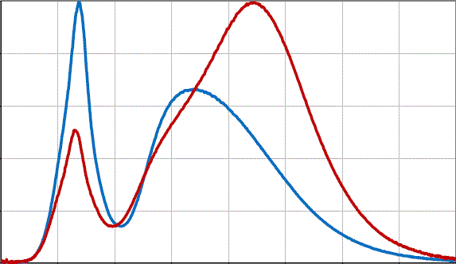  
&nbsp;  

## These binary images were extracted of the individual plot lines

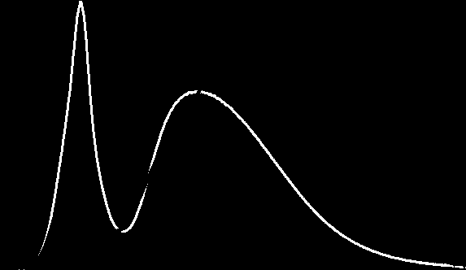  

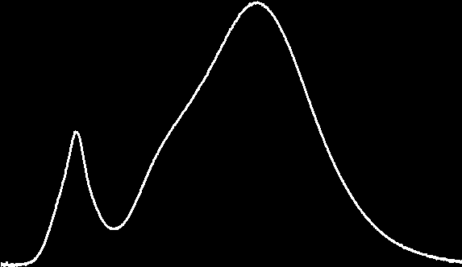  

## Plots' Y-values added together

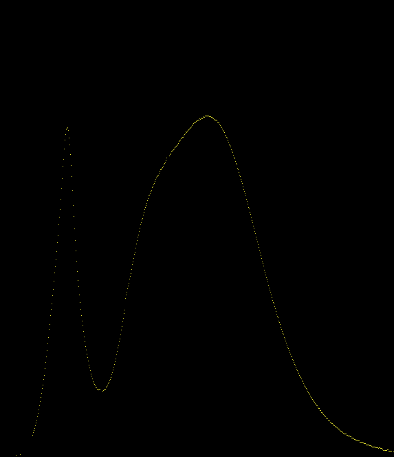  

## Added, then divided by 2  

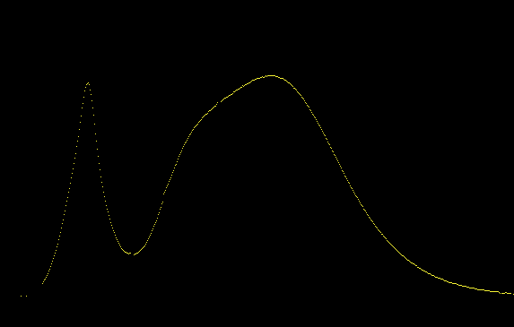  

## Square root of the multiples ( sqrt(y1 * y2) )  

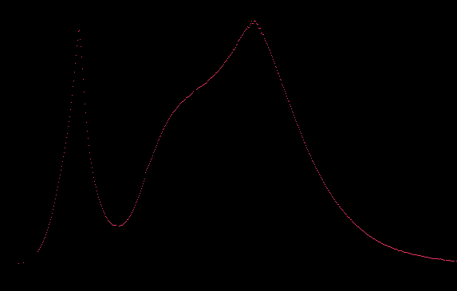  

## Graph of added (yellow) and multiplied (red) lines, both were scaled down.

  

&nbsp;  
&nbsp;  
&nbsp;  
&nbsp;  
&nbsp;  
&nbsp;  
&nbsp;  

## Using this triple-line graph image as input  

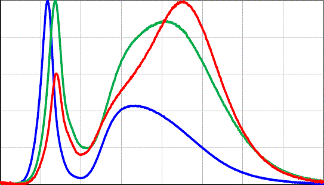  

## The results from processing:  
## Binary images of extracted plots

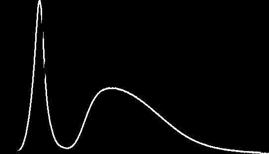  

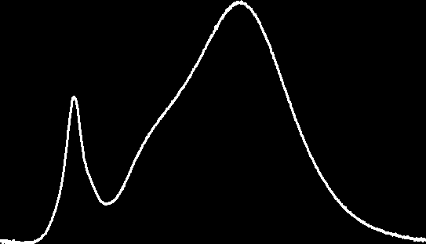  

  

## Added

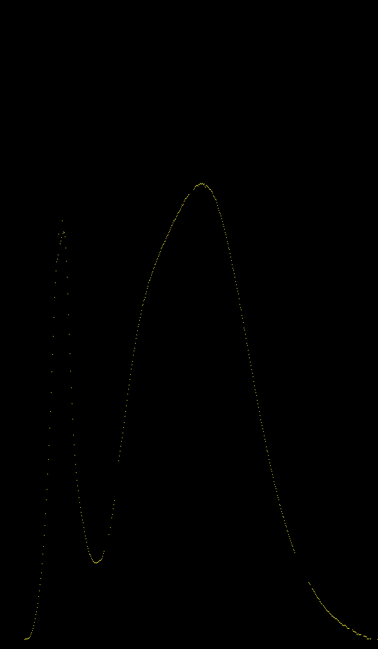  

## Added then divided by 3

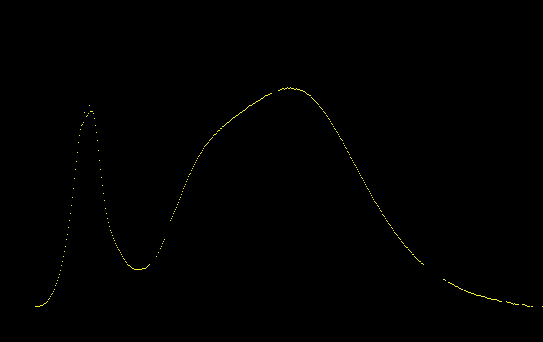  

## Cube root of the multiples ( cube_root(y1 * y2 * y3) )

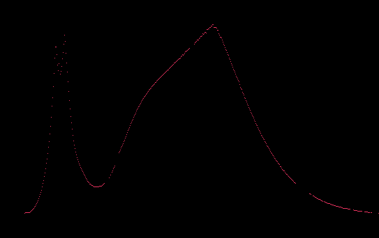  

## Graph of added (yellow) and multiplied (red) lines, both were scaled down.

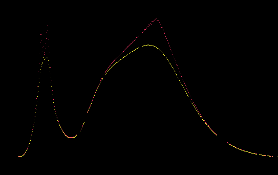  

&nbsp;  
&nbsp;  
&nbsp;  
&nbsp;  
&nbsp;  
## Check out the code I wrote to do this [here](https://github.com/nmz787/opencv-snippets/blob/master/python/combine_plot.py)
